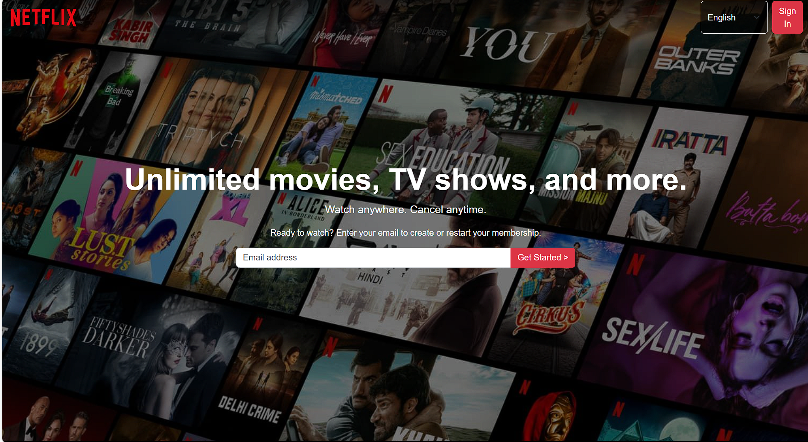

# 🎬 Netflix Landing Page (HTML & CSS)

A responsive front-end clone of the Netflix landing page built using only HTML and CSS. This project is meant for learning and practice purposes, focusing on layout, styling, and responsive design principles.

## 📸 Preview

 <!-- Replace with actual screenshot if available -->

## 🔧 Features

- ✅ Responsive layout (mobile, tablet, and desktop)
- ✅ Header with logo, navigation, and sign-in button
- ✅ Hero section with call-to-action
- ✅ Background image with overlay
- ✅ Footer with multiple link sections

> ⚠️ **Note:** This is a static front-end project and does **not** include any back-end functionality like user authentication, video streaming, or a database.

## 📁 Project Structure
netflix-clone/
├── index.html
│ └── styles.css
 └──script.js
└── README.md
